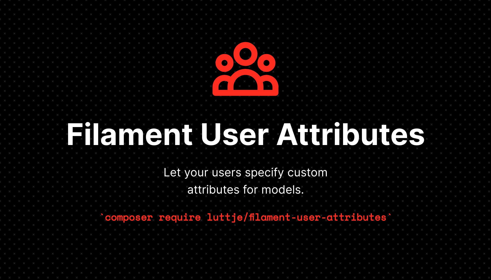
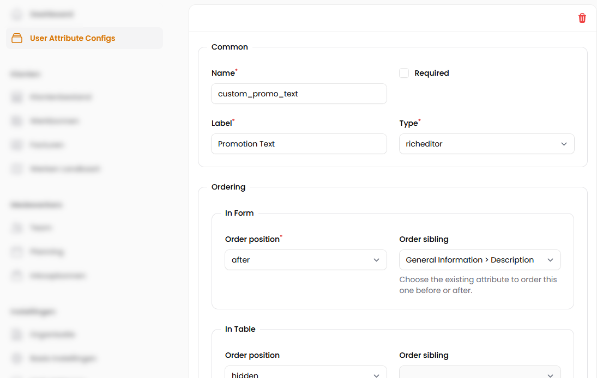
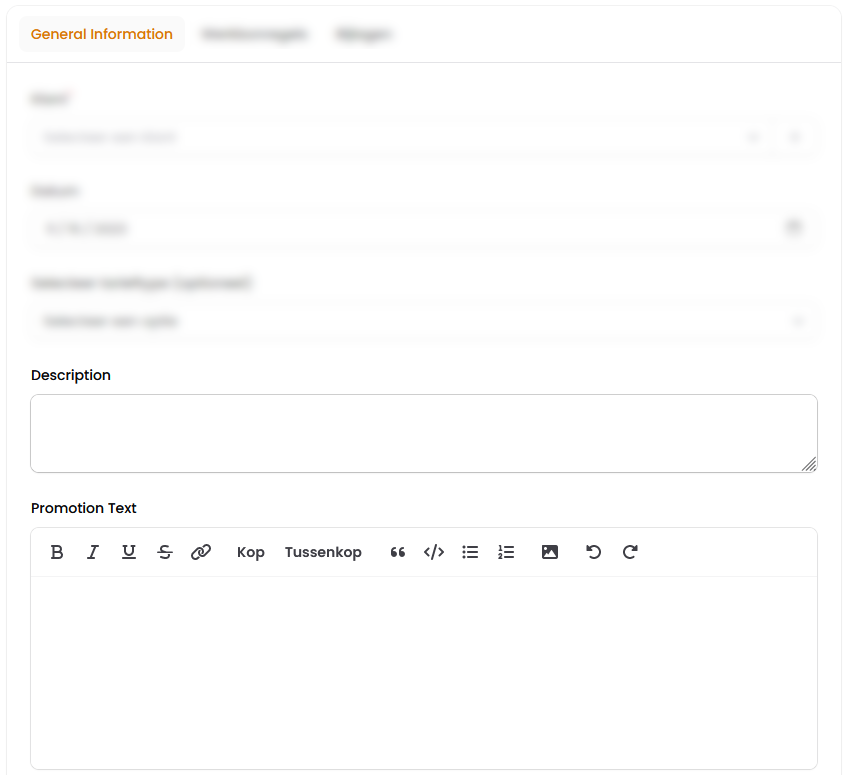

<div align="center">



</div>

> [!Warning]
> This package is still in development. It is not yet ready for production use and the API may change at any time.

<div align="center">

[](https://github.com/luttje/filament-user-attributes/actions/workflows/run-tests.yml)
[](https://coveralls.io/github/luttje/filament-user-attributes?branch=main)
[](https://github.com/luttje/filament-user-attributes/actions/workflows/fix-php-code-styling.yml)

</div>

# Filament User Attributes

Let your users specify custom attributes for models in Filament, similar to Custom Fields in WordPress.

> **Demonstration:** showing the creation of a custom user attribute for the 'Locations' resource of this app:
>
> <https://github.com/luttje/filament-user-attributes/assets/2738114/f0c070a7-2845-4e54-973d-e9d661fa55a0>
>
> In this demonstration:
>
> 1. A checkbox is added and it's order in the table and form is specified.
> 2. The checkbox is displayed in the table and form. Users can now toggle the checkbox and view the value in the table.

> [!Note]
> This is a third-party package not affiliated with Filament or Laravel.

## 🚀 Getting started

1. Make sure your project meets these requirements:
    - PHP 8.1 or higher
    - [Livewire 3.0.3](https://livewire.laravel.com/) or higher
    - [Filament 3.0](https://filamentphp.com/docs) or higher
    - A database that supports JSON columns, e.g:
        - MySQL 5.7.8 or higher
        - PostgreSQL 9.2 or higher
        - SQLite 3.38 or higher

2. Install the [package via composer](https://packagist.org/packages/luttje/filament-user-attributes):

    ```bash
    composer require luttje/filament-user-attributes
    ```

3. Run the following command to fully install the package:

    ```bash
    php artisan filament-user-attributes:install
    ```

    *This publishes the migrations to create the two required tables and runs them.*

4. Run the wizard command to help you setup your project code:

    ```bash
    php artisan filament-user-attributes:wizard
    ```

    The wizard will help you:
    - Specify which models should have custom user attributes
    - Setup a model that can configure the user attributes for each user (e.g. a user or tenant model)
    - Setup resources that the configuration model can configure custom attributes for

    Finally you need to show the user attributes configuration form somewhere. That way users can actually configure their custom attributes for the resource.

5. Create a resource and inherit from the `UserAttributeConfigResource` class:

    ```php
    // app/Filament/Resources/UserAttributeConfigResource.php
    namespace App\Filament\Resources;

    use Luttje\FilamentUserAttributes\Filament\Resources\UserAttributeConfigResource as BaseUserAttributeConfigResource;

    class UserAttributeConfigResource extends BaseUserAttributeConfigResource
    {
        protected static ?string $navigationIcon = 'heroicon-o-rectangle-stack';
    }
    ```

    *Or you can create your own resource from scratch. See the [source code](./src/Filament/Resources/) for inspiration.*

**🎉 That was all, you and your users can now configure custom attributes!**

> Your users (or tenants) can now configure custom attribute fields:
>
> 
>
> The configured custom attributes are (optionally) added to the resource form and table:
>
> 

<table align="center">
<tr>
<td align="middle" colspan="2">
<strong>🎉 You're now ready to:</strong>
</td>
</tr>
<tr>
<td align="middle">🖇</td>
<td><a href="./docs/manual-configurations.md#-user-configured-attributes-for-models">Let your users configure which attributes should be added to models</a></td>
</tr>
<tr>
<td align="middle">🎈</td>
<td><a href="./docs/manual-configurations.md#-filament-livewire-components">Have the custom attribute fields and columns display in a Livewire component</a></td>
</tr>
<tr>
<td align="middle">📎</td>
<td><a href="./docs/additional-api.md#-custom-usage">Set and use the user attributes yourself</a></td>
</tr>
</table>

## ✏ Customizing

- To modify translations, publish the translations file:

    ```bash
    php artisan vendor:publish --tag=filament-user-attributes-translations
    ```

- To modify the configuration, publish the configuration file:

    ```bash
    php artisan vendor:publish --tag=filament-user-attributes-config
    ```

## ✨ Features

- [x] Add custom attributes to any model
- [x] Support for UUIDs
- [x] Support for ULIDs
- [x] Easily display the attributes in a Filament form
- [x] Easily display the attributes in a Filament table
- [x] Sensible validations for input types
- [x] Allow users to specify order of attributes
  - [x] In the form
  - [x] In the table
- [x] Allow users to hide attributes
  - [x] In the form
  - [x] In the table
- [x] Users can specify default values for attributes
- [x] Users can specify if attributes are required
- [x] Users can specify if attributes inherit their value from another attribute, even from a related model
- [x] User interface for managing user attributes
- [x] Support for Tabs and Sections in the form
- [x] Wizard command to help you setup your project code

**Supported Input types:**

- [x] Text
- [x] Textarea
- [x] Number
  - [x] Integer
  - [x] Decimal
  - [x] Specific range
  - [x] Specific decimal places
- [x] Select
  - [x] Specific options
  - [ ] From an existing model property
- [x] Radio
  - [x] Specific options
  - [ ] From an existing model property
- [x] Tags
  - [x] With suggestions
- [x] Date
  - [x] Date
  - [x] Time
  - [x] Date and time
- [x] Checkbox
  - [x] With default
- [x] Toggle
  - [x] With default
- [ ] File
  - [ ] Image
  - [ ] PDF
  - [ ] Other
  - [ ] Preview
- [ ] Color

## ❤ Contributing

Please see [CONTRIBUTING](.github/CONTRIBUTING.md) for details on how to contribute to this project. You'll also find instructions on [how to run the tests](.github/CONTRIBUTING.md#🧪-testing).
